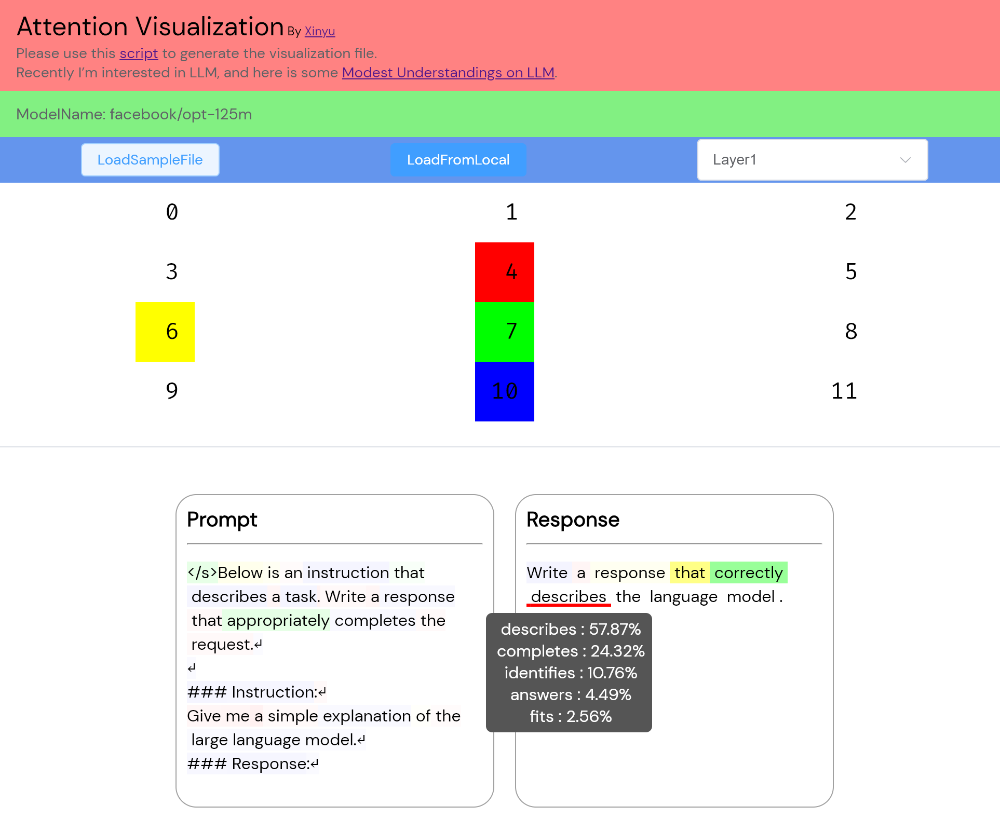

# Attention Visualization

This repository is used to generate the files needed for visualization in the frontend.

## Description

This project contains a series of scripts to generate the files needed in the frontend. 

Here is a sample.


## Installation

Before you begin, make sure your system has the following software installed:

- Python (Version 3.8 or higher recommended)

Then, you can clone this repository with the following command:

```bash
git clone https://github.com/cauyxy/bilivideos.git
```

Next, navigate into the project directory.

```bash
cd bilivideos/attn-visual
```

## Usage

Here are the steps to visualize in the browser:

1. Run the script to generate the files:

```bash
bash run.sh
```

This command will run a script that generates the files needed in the frontend.


2. Navigate to Repository of the frontend and run:

```bash
cd attn-visual
npm install
npm start
```

Now, you can select the previously generated file for visualization in your browser.

## Contributing

If you have any suggestions or issues with this project, feel free to open an issue or submit a pull request.

## License

This project is licensed under the Apache-2.0 License.